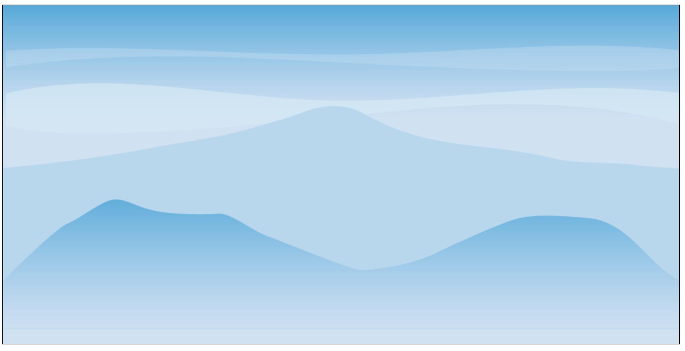

# Aufgabe 1: Hintergrund zeichnen

Repo: https://github.com/sspringer82/sheepnrun

Erstelle ein `<canvas>`-Element der Größe **1024\*768**.

Nutze einen der beiden Hintergründe aus dem Ordner `assets` und zeichne ihn in voller Größe in das Canvas Element.

Zum Zeichnen wird `context.drawImage(x, y, width, height)` benötigt.

**Hinweis:** Der Ursprung des Canvas liegt oben links!

## Ergebnis

